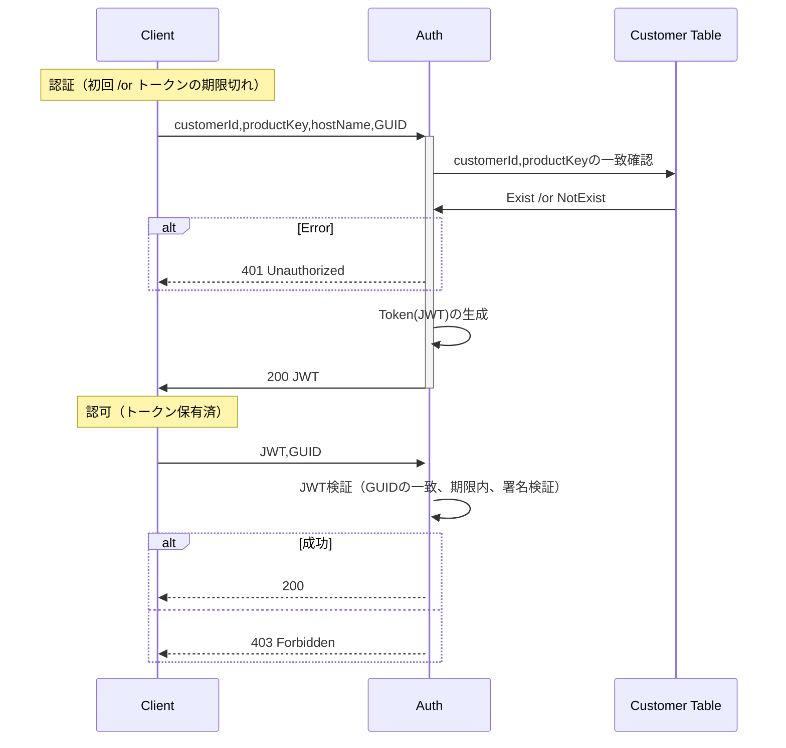
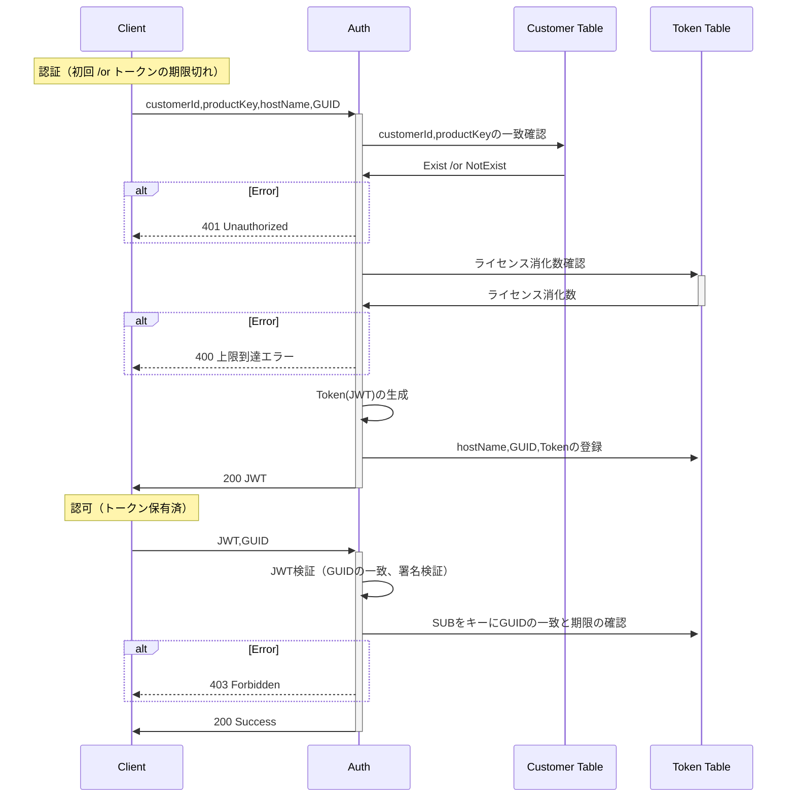

# ライセンス認証 API

端末起動時にライセンス認証を行う。

## ディレクトリ

| ディレクトリ                   | 説明                             |
| ------------------------------ | -------------------------------- |
| ProductActivationService       | アクティベーション REST サービス |
| ProductActivationService.Tests | アクティベーション REST テスト   |

## SQL Server Docker コンテナの起動

```bash
$ docker-compose up -d --build
```

## DB の作成

- DB を作成しておく（テスト用も）
  - CREATE DATABASE SampleService
  - CREATE DATABASE TSampleService
- 接続文字列のメンテ
  - appsettings.{Develop / Testing}.json
  - ProductActivationService.Tests/Utils/FixtureBase.cs

## テーブル

- Token
  - ID
  - Sub
  - GUID
  - Token
  - HostName
  - ExpAt

## 認証フロー

### ステートレスな方法（不採用）

- 認可時に DB アクセスせず検証可だが、JWT 漏洩時に GUID 偽装すればアクセスできてしまう。公開鍵を差し替えれば無効化できるが、同じ鍵で署名した JWT は全て無効となってしまう。

- JWT ペイロード領域
  ```json
  {
    "guid": "1234567890",
    "exp": 1516239022
  }
  ```



### ステートフルな方法

- GUID、期限、無効化フラグをテーブルに保持。検証時に DB アクセスさせて遠隔で JWT を無効化できるようにする。
- JWT の sub をキーにトークンテーブルに保存。
- HS256（秘密鍵を共有）と RS256（非対称鍵）はクライアントのみで署名検証する必要がないので前者とする

- JWT ペイロード領域
  ```json
  {
    "sub": "1234567890"
  }
  ```



## 検案

- アクセストークンの期限切れ時にプロダクトキーの再入力ではなくパスワードなどを個別に入力させる場合はトークンテーブルにパスワードを追加管理する必要がある

## 構築メモ

### プロジェクト追加

```bash
# ソリューション作成
mkdir ProductActivation && cd ProductActivation && dotnet new sln

# REST API追加
dotnet new webapi -o ProductActivationService
dotnet run

# ソリューションにプロジェクト追加
dotnet sln add ProductActivationService/ProductActivationService.csproj
# 追加されたことを確認
dotnet sln list
```

### グローバルツールのインストール

```bash
# グローバルにインストールされているツールのリスト
dotnet tool list -g

# Entity Framework Core ツールのインストール（既にインストールされている場合はinstallをupdateに変えて実行）
dotnet tool install -g dotnet-ef
# インストール確認
dotnet ef

# aspnet-codegenerator のインストール
dotnet tool install --global dotnet-aspnet-codegenerator
```

### Nuget パッケージインストール

```bash
# dotnet ef コマンドでデータベースからモデルを作成する際に使用
dotnet add package Microsoft.EntityFrameworkCore.Design
# データベースにSQL Serverを使用
dotnet add package Microsoft.EntityFrameworkCore.SqlServer
# dotnet aspnet-codegenerator コマンドでモデルからコントローラーを作成する際に使用
dotnet add package Microsoft.EntityFrameworkCore.Tools
# こっちは使わないかもしれない
dotnet add package Microsoft.VisualStudio.Web.CodeGeneration.Design
# Swaggerアノテーション
dotnet add package Swashbuckle.AspNetCore.Annotations
# AutoMapper
dotnet add package AutoMapper.Extensions.Microsoft.DependencyInjection
```

### エンティティの実装

- エンティティクラスの作成
- DbContext を継承した拡張 DbContext クラスを作成

### モデルの実装

- Model の作成
- Entity と Model の Mapper を作成
  - Mapper はサービス層で使用

### リポジトリー・サービスの実装

- Repository の作成
- Service の作成

### リクエストの実装

コントローラーのクエリパラメータに使用する

- Request の作成

### コントローラーの実装

- デザインパターンを使用するので Generator を使わなくても良い

```bash
# コントローラー作成をGeneratorで行う場合
dotnet aspnet-codegenerator controller -name CustomerController -async -api -m Customer -dc MainContext -outDir Controllers
```

- Program.cs でサービス・リポジトリ・コントローラーを登録
- API でコントローラー使うには、ControllerBase を使用すると一通り揃っている
- 個別にルーティングを設定する場合は Controller を継承して実装すると良さそう

### API バージョニングと Swagger 設定

```bash
# バージョン管理を行うためのパッケージを追加
dotnet add package Microsoft.AspNetCore.Mvc.Versioning
dotnet add package Microsoft.AspNetCore.Mvc.Versioning.ApiExplorer
```

参考:

- [.NETCore でアクション別のバージョン管理](https://qiita.com/alicial/items/f095ef52c5677abc3f7e)
- [Managing Multiple Versions of Your API with .NET and Swagger](https://medium.com/@seldah/managing-multiple-versions-of-your-api-with-net-and-swagger-47b4143e8bf5)

MEMO:

- Controller を使用する場合、Create WebAPI 時点で追加されていた`builder.Services.AddEndpointsApiExplorer();`はコメントアウトしても問題なし。Program.cs 内にミニマル API を使って実装している場合に Swagger 出力する際に必要。参考: https://blog.devgenius.io/what-is-addendpointsapiexplorer-in-asp-net-core-6-64ba52d15979#dc8b

### 設定キーの実装

- AppSettings の実装

### コード整形

```bash
# コード整形
dotnet tool install -g dotnet-format
dotnet format .
```

### モデルからマイグレーション作成

- `CREATE DATABASE SampleService`で DB を作成してくおく

```bash
# dotnet ef migrations add --context {コンテキスト名} {マイグレーション名}
dotnet ef migrations add --context MainContext Customer

# DB作成
dotnet ef database update
```

トラブルシューティング

- Only the invariant culture is supported in globalization-invariant mode
  - `<InvariantGlobalization>false</InvariantGlobalization>`を False に設定
- A connection was successfully established with the server, but then an error occurred during the pre-login handshake.
  - `TrustServerCertificate=True`を接続文字列に追加。

## テストプロジェクトの追加

[dotnet テストと xUnit を使用した .NET Core での単体テスト](https://learn.microsoft.com/ja-jp/dotnet/core/testing/unit-testing-with-dotnet-test)

```bash
# テストプロジェクトの作成
dotnet new xunit -o ProductActivationService.Tests
# ソリューションに追加
dotnet sln add ./ProductActivationService.Tests/ProductActivationService.Tests.csproj
```

## テスト構築

パッケージ追加

```bash
# Support for writing functional tests for MVC applications.
dotnet add package Microsoft.AspNetCore.Mvc.Testing
```

参照追加

```xml
<ItemGroup>
  <ProjectReference Include="..\ProductActivationService\ProductActivationService.csproj" />
</ItemGroup>
```

ディレクトリ追加

- Controllers ... コントローラーのテスト
- TestData ... テストデータ
- Utils ... MSSQLServer の DB 作成・削除などの初期化処理

## JWT 認証

```bash
# JWT検証関連
dotnet add package Microsoft.AspNetCore.Authentication.JwtBearer
```
