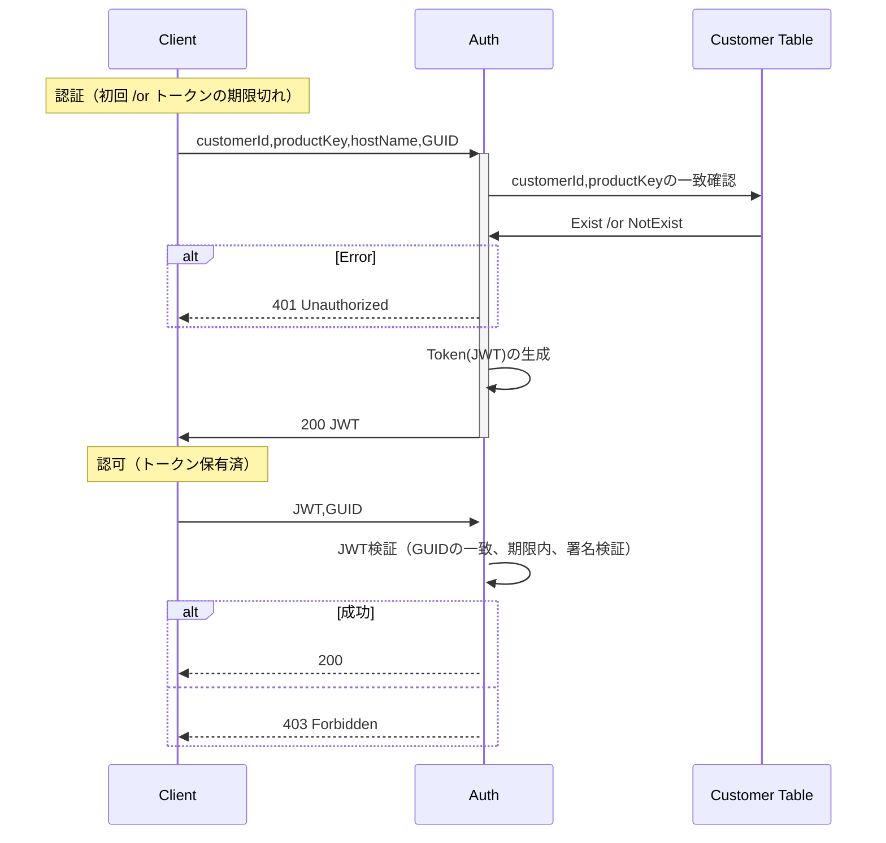
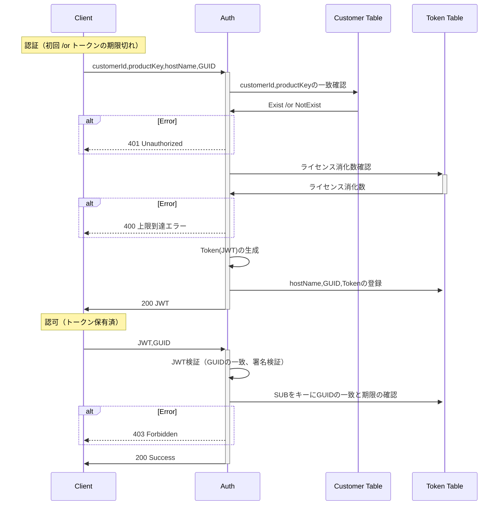

# ライセンス認証 API

端末起動時にライセンス認証を行う。

## ディレクトリ

| ディレクトリ                   | 説明                             |
| ------------------------------ | -------------------------------- |
| ProductActivationService       | アクティベーション REST サービス |
| ProductActivationService.Tests | アクティベーション REST テスト   |

## テーブル

- Customer

  - ID
  - productKey
  - LicenseAmount

- Token
  - ID
  - Sub
  - GUID
  - Token
  - HostName
  - ExpAt

## 認証フロー

### ステートレスな方法（不採用）

- 認可時に DB アクセスせず検証可だが、JWT 漏洩時に GUID 偽装すればアクセスできてしまう。公開鍵を差し替えれば無効化できるが、同じ鍵で署名した JWT は全て無効となってしまう。

- JWT ペイロード領域
  ```json
  {
    "guid": "1234567890",
    "exp": 1516239022
  }
  ```



### ステートフルな方法

- GUID、期限、無効化フラグをテーブルに保持。検証時に DB アクセスさせて遠隔で JWT を無効化できるようにする。
- JWT の sub をキーにトークンテーブルに保存。

- JWT ペイロード領域
  ```json
  {
    "sub": "1234567890"
  }
  ```



## 検案

- アクセストークンの期限切れ時にプロダクトキーの再入力ではなくパスワードなどを個別に入力させる場合はトークンテーブルにパスワードを追加管理する必要がある

## 構築メモ

```bash
# ソリューション作成
mkdir ProductActivation && cd ProductActivation && dotnet new sln

# REST API追加
dotnet new webapi -o ProductActivationService
dotnet run

# ソリューションにプロジェクト追加
dotnet sln add ProductActivationService/ProductActivationService.csproj
# 追加されたことを確認
dotnet sln list
```
